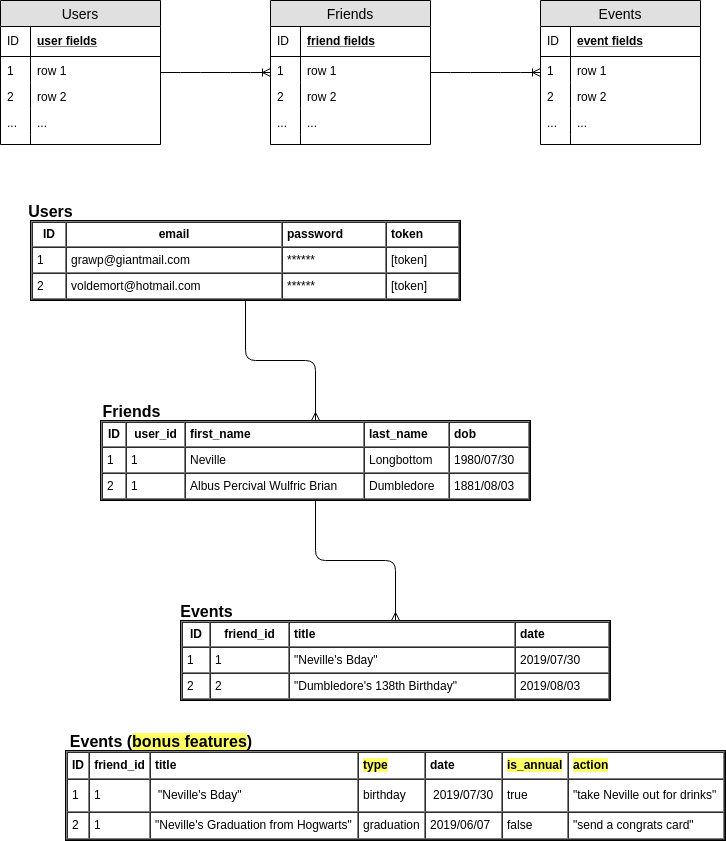
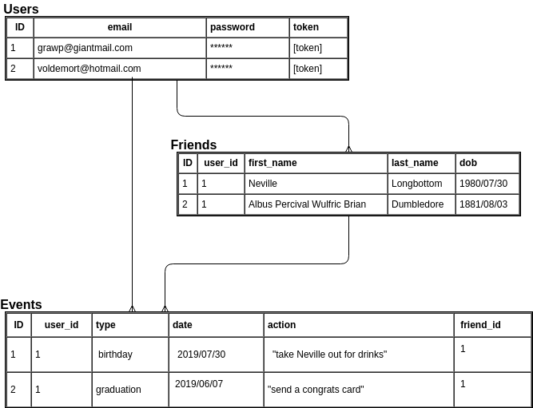

# K Strickland's Evento App - API

[Check out my front-end repo's README for more information](https://github.com/kstrickland0612/evento-client)

Database is deployed at https://sheltered-cliffs-69470.herokuapp.com/

## ERD

My Entity Relationship Diagram changed a bit based on what I learned about rails and how SQL databases work.

My first ERD had a one to many relationship of users to friends, and another one to many relationship of friends to event.

I found that I actually needed a one to many relationships of users to friends and also of users to events, while keeping the one to many relationship of friends to events.

- **My V1 ERD:**

- **My final version ERD** (notice all the bonus features from v1 are incorporated now):

## Wanna try it?
### [You can use Evento here!](https://kstrickland0612.github.io/evento-client/)

### [The deployed Heroku database lives here](https://sheltered-cliffs-69470.herokuapp.com/)

### [Take a look at my front-end repo here](https://github.com/kstrickland0612/evento-client)
